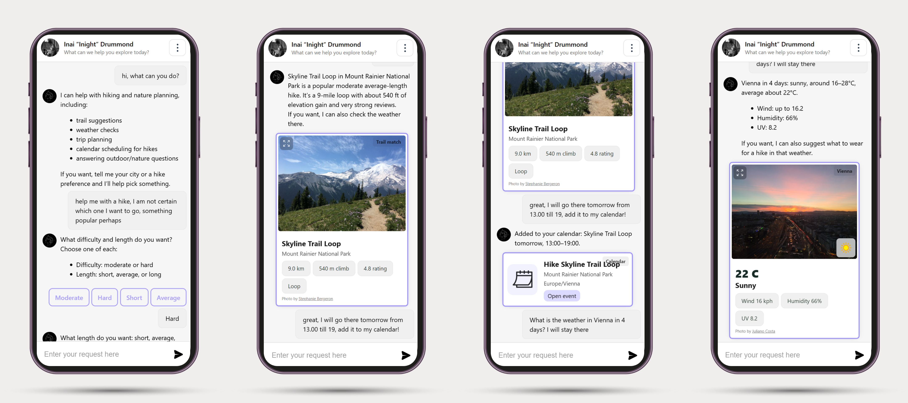

# AscendAi



AscendAi is an AI assistant designed to enhance one's hiking experience by providing tips, suggestions, information, and photos of specific locations. AscendAi can answer hiking questions, ask for missing preferences, recommend trails, check the weather, create Google Calendar events, and suggest answers.

## TL;DR

A **React** and **Node.js** AI assistant built on the LangChain library.

- Uses a **LangChain** DeepAgent to decide when to call helper tools
- Stores user messages, assistant messages, and structured tool outputs in **PostgreSQL**
- Renders tool outputs as frontend cards for suggestions, weather, hiking, and calendar actions (the list is expanding, new features under development)
- Integrates Google OAuth, Google Calendar, WeatherAPI, Unsplash, **OpenAI**, and a local trail dataset

## Motivation

As a big fan of hiking and overall outdoor experiences, I noticed a big gap in the field: there are not that many unique tools for hiking that are multi-tools that can gather all information in one place and help me plan my next outdoor trip. There are certain websites, but they all lack the planning experience present during the active exploration of different places on the computer. To fill the gap, I decided to build AscendAi. This is an AI tool designed to assist you with your next hike while leaving all necessary actions to you. Every experience is unique, and AscendAi is designed with that in mind. AscendAi is currently under development.

## Quick start

0. **Requirements**

- Node.js and npm
- PostgreSQL-compatible database
- Google OAuth client credentials
- OpenAI API key
- WeatherAPI key
- Unsplash access key

1. **Install backend dependencies**

```bash
cd backend
npm install
```

2. **Create backend environment file**

Create `backend/.env` with the following variables:

```env
PORT=5000
DB_ENDPOINT=
DB_USERNAME=
DB_PASSWORD=
DB_NAME=
OPEN_AI_API_KEY=
OAUTH_CLIENT_ID=
OAUTH_CLIENT_SECRET=
WEATHER_API_KEY=
UPSPLASH_ACCESS_KEY=
```

3. **Run database migrations**

```bash
npm run db:migrate
```

4. **Start the backend**

```bash
node index.js
```

5. **Install and start the frontend**

```bash
cd ../frontend
npm install
npm start
```

The frontend runs on `http://localhost:3000` and expects the backend on `http://localhost:5000`.


## App overview

```
    ___       ___       ___       ___       ___       ___            ___       ___   
   /\  \     /\  \     /\  \     /\  \     /\__\     /\  \          /\  \     /\  \  
  /::\  \   /::\  \   /::\  \   /::\  \   /:| _|_   /::\  \        /::\  \   _\:\  \ 
 /::\:\__\ /\:\:\__\ /:/\:\__\ /::\:\__\ /::|/\__\ /:/\:\__\      /::\:\__\ /\/::\__\
 \/\::/  / \:\:\/__/ \:\ \/__/ \:\:\/  / \/|::/  / \:\/:/  /      \/\::/  / \::/\/__/
   /:/  /   \::/  /   \:\__\    \:\/  /    |:/  /   \::/  /         /:/  /   \:\__\  
   \/__/     \/__/     \/__/     \/__/     \/__/     \/__/          \/__/     \/__/            
```
AscendAi uses a visual messenger interface. Users sign in with Google, chat with the assistant, and receive both normal text messages and structured helper cards. The UI is designed around hiking planning, with photo cards for places and trails, account controls, confirmation overlays, and fullscreen image previews.

### External services

- **OpenAI / LangChain**: assistant reasoning and tool orchestration
- **PostgreSQL**: message, helper-output, and trail storage
- **Google OAuth**: user authentication
- **Google Calendar API**: calendar and event creation
- **WeatherAPI**: weather data
- **Unsplash API**: city and trail photos

### Implemented helper cards

- **Suggestions**: quick tappable answer choices when the assistant needs clarification
- **Hiking**: trail recommendation with photo, location, distance, elevation, rating, and route type
- **Calendar**: Google Calendar event confirmation with event title, location, time zone, and link
- **Weather**: city photo, condition, temperature, wind, humidity, and UV information


## Project information

## Status

**AscendAi is under active development.** Planned improvements include more helper tools, better UI states, and more robust deployment configuration.

### Contact

For questions, please open an issue or contact `r.chervinskyy@gmail.com`.

### License

This project is licensed under the Apache License 2.0.

### File structure

```
AscendAi/
|── backend/
|   |── index.js                            # Express server entry point
|   |── package.json
|   └── src/
|       |── agent/
|       |   └── index.js                    # AscendAi DeepAgent configuration
|       |── database/                       # PostgreSQL and OpenAI clients, table migrations
|       |── datasets/                       # Dataset import/check utilities
|       |── routes/                         # /message routes, auth, persistence, tool extraction
|       |── services/                       # Unsplash photo lookup service
|       └── tools/
|           |── callendar.js                # Google Calendar tool
|           |── getTrail.js                 # Trail recommendation tool
|           |── suggestAnswers.js           # Suggestion UI tool
|           └── weather.js                  # Weather tool
|
|── frontend/
|   |── package.json
|   |── public/
|   └── src/
|       |── App.js                          # Main chat application
|       |── app.module.css                  # Main app styling
|       |── assets/
|       |   |── ImgBuilder.js               # Central image/icon registry
|       |   └── images/                     # Local UI images and icons
|       |── components/                     # UI componenets
|       └── theme/
|
|── images/                              # README/demo screenshots
|── LICENSE.txt                          # Apache License 2.0
└── README.md                            # <== You are here
```
